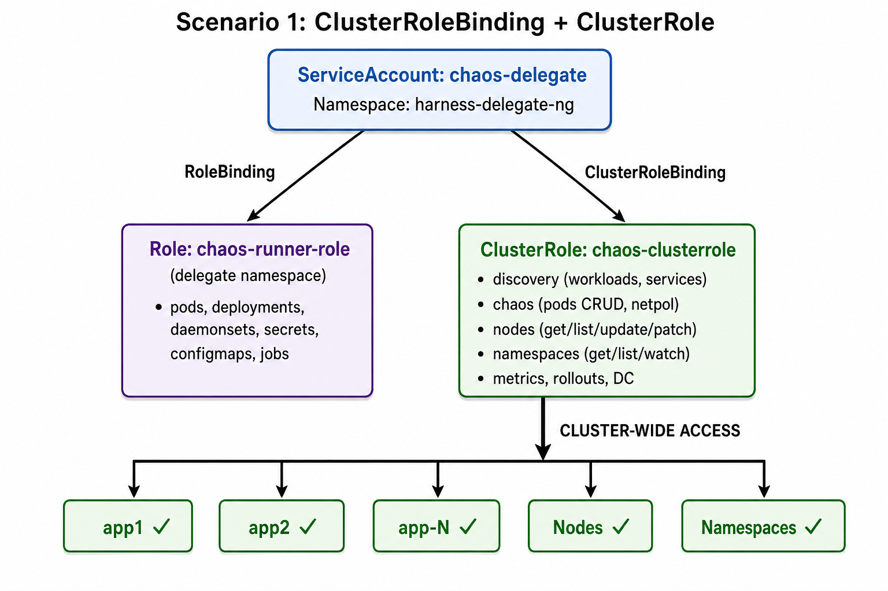
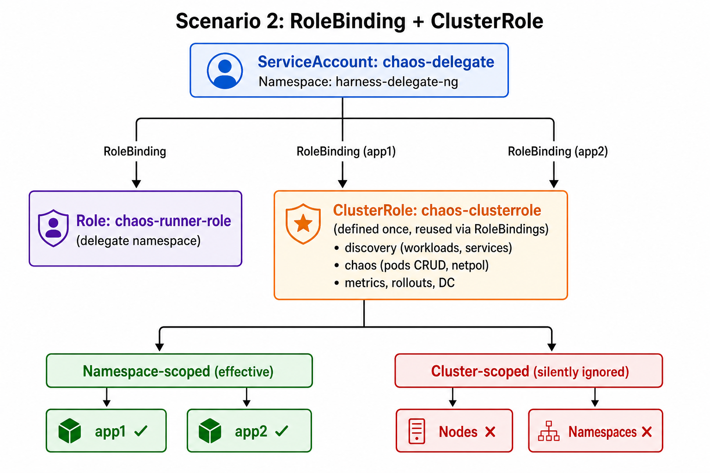
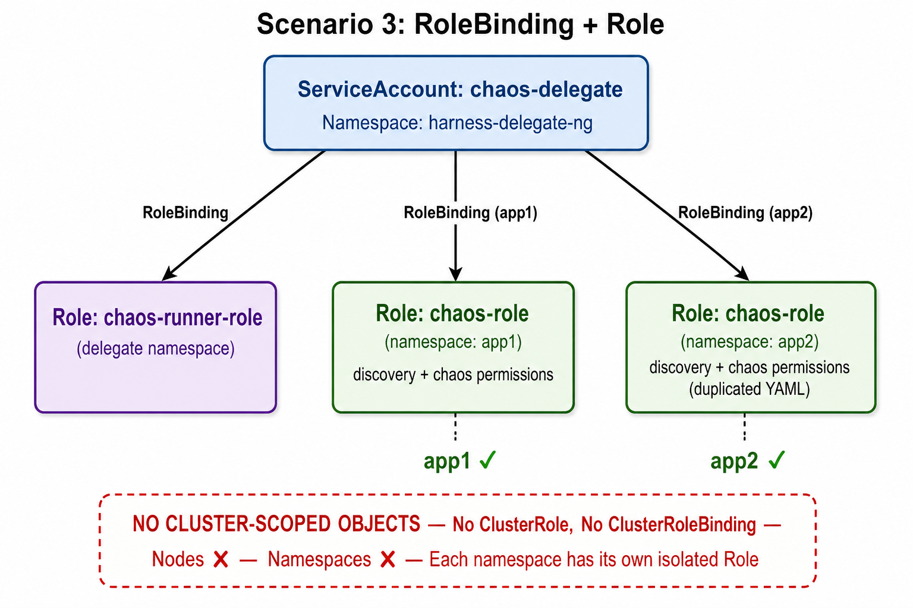
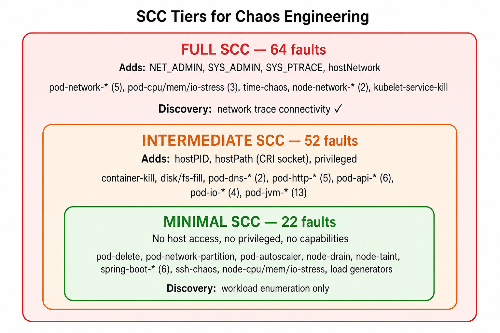

# DDCR RBAC Scenarios — Chaos Faults & Service Discovery

**Document Version:** 3.0
**Last Updated:** May 25, 2026

**References:**
- [Centralized Delegate](https://developer.harness.io/docs/chaos-engineering/guides/infrastructures/types/ddcr/centralized-delegate/)
- [Dedicated Delegate](https://developer.harness.io/docs/chaos-engineering/guides/infrastructures/types/ddcr/dedicated-delegate/)
- [Service Discovery — Restrict to Specific Namespace(s)](https://developer.harness.io/docs/platform/service-discovery/user-defined-service-account)

---

## Table of Contents

1. [Overview](#overview)
2. [Service Discovery — Background](#service-discovery--background)
3. [Scenario 1 — ClusterRoleBinding + ClusterRole](#scenario-1--clusterrolebinding--clusterrole)
4. [Scenario 2 — RoleBinding + ClusterRole](#scenario-2--rolebinding--clusterrole)
5. [Scenario 3 — RoleBinding + Role](#scenario-3--rolebinding--role)
6. [Chaos Fault Support Matrix](#chaos-fault-support-matrix)
7. [Service Discovery Support Matrix](#service-discovery-support-matrix)
8. [SCC Requirements by Fault Category](#scc-requirements-by-fault-category)
9. [Comparison Summary](#comparison-summary)
10. [Recommendation](#recommendation)

---

## Overview

When configuring Harness Delegate-Driven Chaos Runner (DDCR) infrastructure, the RBAC model you choose affects two areas:

1. **Chaos Faults** — which experiments can execute (pod-level, node-level, network, etc.)
2. **Service Discovery** — whether the Harness Discovery Agent can discover workloads, services, and network connectivity in your cluster

This document covers three RBAC scenarios, each providing a different balance of capability vs. least-privilege security for both chaos and discovery.

**Common across all scenarios:** A dedicated namespace (e.g., `harness-delegate-ng`) hosts the delegate and chaos runner pods. A ServiceAccount in that namespace is used by the delegate to orchestrate chaos experiments and service discovery.

### Scenario Comparison — Visual Overview

All three scenarios share a common ServiceAccount (`chaos-delegate`) in the delegate namespace. The key difference is how permissions are bound to application namespaces and whether cluster-scoped resources (nodes, namespaces) are accessible.

| Scenario | Binding | Role Type | Nodes / Namespaces | Diagram |
| :--- | :--- | :--- | :---: | :--- |
| 1 | ClusterRoleBinding | ClusterRole | Accessible | See Scenario 1 below |
| 2 | RoleBinding (per ns) | ClusterRole | Silently ignored | See Scenario 2 below |
| 3 | RoleBinding (per ns) | Role (per ns) | Not possible | See Scenario 3 below |

---

## Service Discovery — Background

Harness Service Discovery is a platform feature that discovers workloads and services running in your Kubernetes cluster. It powers the Harness UI for target selection, application maps, and network topology visualization.

### Discovery Features

| Feature | Description | Cluster-scoped resources needed? |
| :--- | :--- | :--- |
| **Workload discovery** | Enumerate deployments, pods, services, statefulsets, etc. in a namespace | No |
| **Multi-namespace discovery** | Discover workloads across multiple onboarded namespaces | No (RoleBinding per namespace) |
| **Namespace listing** | Auto-enumerate all namespaces in the cluster | Yes (namespaces) |
| **Network trace connectivity** | Detect traffic patterns and service-to-service connectivity | Yes (nodes) |
| **Auto-create network experiments** | Automatically generate network chaos experiments from discovered topology | Yes (nodes + namespaces) |

---

## Scenario 1 — ClusterRoleBinding + ClusterRole



### When to Use

- You need **full chaos coverage** including node-level faults (node-drain, node-taint, node-restart, etc.)
- You need **cluster-wide service discovery** with automatic namespace enumeration and network trace connectivity
- The delegate should have access to **all namespaces** without onboarding each one individually
- You are in a **development/staging** environment or a dedicated chaos cluster where broad permissions are acceptable

### RBAC YAML

```yaml
apiVersion: v1
kind: ServiceAccount
metadata:
  name: chaos-delegate
  namespace: harness-delegate-ng
---
# Chaos Runner + Discovery Management Role (delegate namespace)
apiVersion: rbac.authorization.k8s.io/v1
kind: Role
metadata:
  name: chaos-runner-role
  namespace: harness-delegate-ng
rules:
  # Chaos runner pod lifecycle
  - apiGroups: ["apps"]
    resources: [deployments, replicasets, daemonsets, statefulsets]
    verbs: [create, delete, get, list, patch, update, watch, deletecollection]
  - apiGroups: [""]
    resources: [pods, pods/log, pods/exec, secrets, services, configmaps]
    verbs: [create, delete, get, list, patch, update, watch, deletecollection]
  - apiGroups: ["batch"]
    resources: [jobs, cronjobs]
    verbs: [create, delete, get, list, patch, update, watch, deletecollection]
---
apiVersion: rbac.authorization.k8s.io/v1
kind: RoleBinding
metadata:
  name: chaos-runner-rolebinding
  namespace: harness-delegate-ng
subjects:
  - kind: ServiceAccount
    name: chaos-delegate
    namespace: harness-delegate-ng
roleRef:
  kind: Role
  name: chaos-runner-role
  apiGroup: rbac.authorization.k8s.io
---
# ClusterRole — discovery + chaos + node permissions
apiVersion: rbac.authorization.k8s.io/v1
kind: ClusterRole
metadata:
  name: chaos-clusterrole
rules:
  # Discovery — workloads
  - apiGroups: ["apps"]
    resources: [deployments, replicasets, daemonsets, statefulsets]
    verbs: [watch, list, get]
  - apiGroups: [""]
    resources: [pods, replicationcontrollers, services]
    verbs: [watch, list, get]
  - apiGroups: ["batch"]
    resources: [jobs, cronjobs]
    verbs: [watch, list, get]
  # Discovery — cluster-scoped (namespace listing + network trace)
  - apiGroups: [""]
    resources: [nodes, namespaces]
    verbs: [watch, list, get]
  # Chaos — pods
  - apiGroups: [""]
    resources: [pods]
    verbs: [create, delete, get, list, patch, update, watch, deletecollection]
  # Chaos — network policies
  - apiGroups: ["networking.k8s.io"]
    resources: [networkpolicies]
    verbs: [create, delete, get, list]
  # Chaos — metrics (for CMD probe CPU/memory checks)
  - apiGroups: ["metrics.k8s.io"]
    resources: [pods, nodes]
    verbs: [get, list]
  # Chaos — workload updates (e.g., pod-autoscaler)
  - apiGroups: ["apps"]
    resources: [deployments, replicasets, daemonsets, statefulsets]
    verbs: [list, get, update]
  - apiGroups: [""]
    resources: [replicationcontrollers, services]
    verbs: [get, list]
  # Chaos — node operations (node-taint, node-drain)
  - apiGroups: [""]
    resources: [nodes]
    verbs: [get, list, watch, update, patch]
  # OpenShift / Argo Rollouts
  - apiGroups: ["apps.openshift.io"]
    resources: [deploymentconfigs]
    verbs: [list, get]
  - apiGroups: ["argoproj.io"]
    resources: [rollouts]
    verbs: [list, get]
---
# ClusterRoleBinding — grants cluster-wide access
apiVersion: rbac.authorization.k8s.io/v1
kind: ClusterRoleBinding
metadata:
  name: chaos-clusterrolebinding
roleRef:
  apiGroup: rbac.authorization.k8s.io
  kind: ClusterRole
  name: chaos-clusterrole
subjects:
  - kind: ServiceAccount
    name: chaos-delegate
    namespace: harness-delegate-ng
```

### Supported Faults

**All faults are supported**, including:

- All pod-level faults (pod-delete, pod-cpu-hog, pod-network-\*, pod-dns-\*, pod-http-\*, pod-jvm-\*, etc.)
- All node-level faults (node-taint, node-drain, node-cpu-hog, node-memory-hog, node-io-stress, node-network-\*, node-restart)
- kubelet-service-kill, kubelet-density
- pod-autoscaler, pod-network-partition
- Pod faults with NODE_LABEL filtering
- spring-boot-\*, container-kill, disk-fill, fs-fill, time-chaos

### Service Discovery Support

| Feature | Supported? | Notes |
| :--- | :---: | :--- |
| Workload discovery (deployments, pods, services, etc.) | Yes | All namespaces |
| Multi-namespace discovery | Yes | Automatic — no per-namespace onboarding needed |
| Namespace listing | Yes | namespaces get/list/watch granted cluster-wide |
| Network trace connectivity | Yes | nodes get/list/watch granted cluster-wide |
| Auto-create network experiments | Yes | Both nodes and namespaces available |

### Pros

| # | Pro |
| :--- | :--- |
| 1 | Full fault coverage — no limitations on experiment types |
| 2 | Full service discovery — all features including network trace connectivity |
| 3 | Zero namespace onboarding effort — works across all namespaces automatically |
| 4 | Simplest to set up and maintain — one ClusterRole, one ClusterRoleBinding |
| 5 | NODE_LABEL filtering works on all pod faults |

### Cons

| # | Con |
| :--- | :--- |
| 1 | Broadest attack surface — SA has cluster-wide permissions |
| 2 | Violates least-privilege principle for teams that only need pod-level chaos |

---

## Scenario 2 — RoleBinding + ClusterRole



### When to Use

- You want to **reuse a single ClusterRole definition** across multiple namespaces without duplicating YAML
- You need namespace-scoped chaos only — **no node-level faults required**
- You want to **selectively onboard** application namespaces by creating a RoleBinding in each one
- Service discovery per onboarded namespace is sufficient — you don't need cluster-wide namespace listing or network trace connectivity

### RBAC YAML

```yaml
apiVersion: v1
kind: ServiceAccount
metadata:
  name: chaos-delegate
  namespace: harness-delegate-ng
---
# Chaos Runner + Discovery Management Role (delegate namespace)
apiVersion: rbac.authorization.k8s.io/v1
kind: Role
metadata:
  name: chaos-runner-role
  namespace: harness-delegate-ng
rules:
  # Chaos runner pod lifecycle
  - apiGroups: ["apps"]
    resources: [deployments, replicasets, daemonsets, statefulsets]
    verbs: [create, delete, get, list, patch, update, watch, deletecollection]
  - apiGroups: [""]
    resources: [pods, pods/log, pods/exec, secrets, services, configmaps]
    verbs: [create, delete, get, list, patch, update, watch, deletecollection]
  - apiGroups: ["batch"]
    resources: [jobs, cronjobs]
    verbs: [create, delete, get, list, patch, update, watch, deletecollection]
---
apiVersion: rbac.authorization.k8s.io/v1
kind: RoleBinding
metadata:
  name: chaos-runner-rolebinding
  namespace: harness-delegate-ng
subjects:
  - kind: ServiceAccount
    name: chaos-delegate
    namespace: harness-delegate-ng
roleRef:
  kind: Role
  name: chaos-runner-role
  apiGroup: rbac.authorization.k8s.io
---
# ClusterRole — defined once, referenced by RoleBindings per namespace
# Contains both discovery and chaos permissions
apiVersion: rbac.authorization.k8s.io/v1
kind: ClusterRole
metadata:
  name: chaos-clusterrole
rules:
  # Discovery — workloads
  - apiGroups: ["apps"]
    resources: [deployments, replicasets, daemonsets, statefulsets]
    verbs: [watch, list, get]
  - apiGroups: [""]
    resources: [pods, replicationcontrollers, services]
    verbs: [watch, list, get]
  - apiGroups: ["batch"]
    resources: [jobs, cronjobs]
    verbs: [watch, list, get]
  # Chaos — pods
  - apiGroups: [""]
    resources: [pods]
    verbs: [create, delete, get, list, patch, update, watch, deletecollection]
  # Chaos — network policies
  - apiGroups: ["networking.k8s.io"]
    resources: [networkpolicies]
    verbs: [create, delete, get, list]
  # Chaos — metrics
  - apiGroups: ["metrics.k8s.io"]
    resources: [pods]
    verbs: [get, list]
  # Chaos — workload updates
  - apiGroups: ["apps"]
    resources: [deployments, replicasets, daemonsets, statefulsets]
    verbs: [list, get, update]
  - apiGroups: [""]
    resources: [replicationcontrollers, services]
    verbs: [get, list]
  # OpenShift / Argo Rollouts
  - apiGroups: ["apps.openshift.io"]
    resources: [deploymentconfigs]
    verbs: [list, get]
  - apiGroups: ["argoproj.io"]
    resources: [rollouts]
    verbs: [list, get]
---
# RoleBinding per application namespace (repeat for app2, app3, ...)
apiVersion: rbac.authorization.k8s.io/v1
kind: RoleBinding
metadata:
  name: chaos-rolebinding
  namespace: app1
subjects:
  - kind: ServiceAccount
    name: chaos-delegate
    namespace: harness-delegate-ng
roleRef:
  kind: ClusterRole
  name: chaos-clusterrole
  apiGroup: rbac.authorization.k8s.io
```

> **Note:** Even if you add `nodes` or `namespaces` to the ClusterRole, a RoleBinding **cannot grant access to cluster-scoped resources**. Those permissions are silently ignored.

### Supported Faults

All **pod-level and namespace-scoped** faults:

- pod-delete, container-kill, pod-cpu-hog, pod-memory-hog, pod-io-stress
- pod-network-latency, pod-network-loss, pod-network-corruption, pod-network-duplication, pod-network-rate-limit
- pod-network-partition
- pod-dns-error, pod-dns-spoof
- pod-http-\*, pod-api-\*, pod-io-\*, pod-jvm-\*
- pod-autoscaler
- disk-fill, fs-fill, time-chaos
- spring-boot-\*, pod-application-function-\*
- k6-load-generator, locust-load-generator, byoc-injector, ssh-chaos

### Faults That Will NOT Work

| Fault | Reason |
| :--- | :--- |
| node-taint | Requires nodes update (cluster-scoped) |
| node-drain | Requires nodes get/patch/update (cluster-scoped) + cluster-wide pods/eviction create for draining pods across all namespaces on the node |
| node-cpu-hog | Requires nodes get/list (cluster-scoped) |
| node-memory-hog | Requires nodes get/list (cluster-scoped) |
| node-io-stress | Requires nodes get/list (cluster-scoped) |
| node-network-latency | Requires nodes get/list (cluster-scoped) |
| node-network-loss | Requires nodes get/list (cluster-scoped) |
| node-restart | Requires nodes get (cluster-scoped) |
| kubelet-service-kill | Requires nodes get/list (cluster-scoped) |
| kubelet-density | Requires nodes list + cross-namespace pod operations |
| Any pod fault with NODE_LABEL | Requires nodes list (cluster-scoped) |

### Service Discovery Support

| Feature | Supported? | Notes |
| :--- | :---: | :--- |
| Workload discovery (deployments, pods, services, etc.) | Yes | Only in namespaces with a RoleBinding |
| Multi-namespace discovery | Yes | Create a RoleBinding in each target namespace |
| Namespace listing | **No** | namespaces is cluster-scoped — silently ignored by RoleBinding |
| Network trace connectivity | **No** | nodes is cluster-scoped — silently ignored by RoleBinding |
| Auto-create network experiments | **No** | Requires both nodes and namespaces (cluster-scoped) |

> **UI Note:** When configuring the Discovery Agent in Harness, use the **Inclusion** option to specify namespaces manually (since automatic namespace listing is unavailable). **Disable "Detect network trace connectivity"** in the UI.

### Pros

| # | Pro |
| :--- | :--- |
| 1 | Define permissions **once** in a ClusterRole, reuse via RoleBindings |
| 2 | Namespace isolation — each namespace is explicitly onboarded for both chaos and discovery |
| 3 | Cluster-scoped permissions are automatically excluded (least-privilege for nodes) |
| 4 | Easy to onboard/offboard namespaces — just add/remove a RoleBinding |
| 5 | Service discovery works for all onboarded namespaces with a single ClusterRole definition |

### Cons

| # | Con |
| :--- | :--- |
| 1 | No node-level faults |
| 2 | NODE_LABEL filtering unavailable on pod faults |
| 3 | No network trace connectivity — cannot discover service-to-service traffic patterns |
| 4 | No automatic namespace listing — must manually specify namespaces in Harness UI |
| 5 | ClusterRole object still exists cluster-wide (even though it grants nothing without a ClusterRoleBinding) |
| 6 | Requires a RoleBinding in **each** application namespace |

---

## Scenario 3 — RoleBinding + Role



### When to Use

- You want the **strictest least-privilege** model with no cluster-scoped objects at all
- Security policies prohibit ClusterRole or ClusterRoleBinding resources entirely
- You are running chaos in a **multi-tenant** cluster where teams manage their own RBAC
- **Production environments** where every permission must be explicitly justified per namespace
- You want the ability to **customize permissions per namespace** (e.g., allow different discovery or chaos permissions in different namespaces)

### RBAC YAML

```yaml
apiVersion: v1
kind: ServiceAccount
metadata:
  name: chaos-delegate
  namespace: harness-delegate-ng
---
# Chaos Runner + Discovery Management Role (delegate namespace)
apiVersion: rbac.authorization.k8s.io/v1
kind: Role
metadata:
  name: chaos-runner-role
  namespace: harness-delegate-ng
rules:
  # Chaos runner pod lifecycle
  - apiGroups: ["apps"]
    resources: [deployments, replicasets, daemonsets, statefulsets]
    verbs: [create, delete, get, list, patch, update, watch, deletecollection]
  - apiGroups: [""]
    resources: [pods, pods/log, pods/exec, secrets, services, configmaps]
    verbs: [create, delete, get, list, patch, update, watch, deletecollection]
  - apiGroups: ["batch"]
    resources: [jobs, cronjobs]
    verbs: [create, delete, get, list, patch, update, watch, deletecollection]
---
apiVersion: rbac.authorization.k8s.io/v1
kind: RoleBinding
metadata:
  name: chaos-runner-rolebinding
  namespace: harness-delegate-ng
subjects:
  - kind: ServiceAccount
    name: chaos-delegate
    namespace: harness-delegate-ng
roleRef:
  kind: Role
  name: chaos-runner-role
  apiGroup: rbac.authorization.k8s.io
---
# Role per application namespace (must be duplicated for each namespace)
apiVersion: rbac.authorization.k8s.io/v1
kind: Role
metadata:
  name: chaos-role
  namespace: app1
rules:
  # Discovery — workloads
  - apiGroups: ["apps"]
    resources: [deployments, replicasets, daemonsets, statefulsets]
    verbs: [watch, list, get]
  - apiGroups: [""]
    resources: [pods, replicationcontrollers, services]
    verbs: [watch, list, get]
  - apiGroups: ["batch"]
    resources: [jobs, cronjobs]
    verbs: [watch, list, get]
  # Chaos — pods
  - apiGroups: [""]
    resources: [pods]
    verbs: [create, delete, get, list, patch, update, watch, deletecollection]
  # Chaos — network policies
  - apiGroups: ["networking.k8s.io"]
    resources: [networkpolicies]
    verbs: [create, delete, get, list]
  # Chaos — metrics
  - apiGroups: ["metrics.k8s.io"]
    resources: [pods]
    verbs: [get, list]
  # Chaos — workload updates
  - apiGroups: ["apps"]
    resources: [deployments, replicasets, daemonsets, statefulsets]
    verbs: [list, get, update]
  - apiGroups: [""]
    resources: [replicationcontrollers, services]
    verbs: [get, list]
  # OpenShift / Argo Rollouts
  - apiGroups: ["apps.openshift.io"]
    resources: [deploymentconfigs]
    verbs: [list, get]
  - apiGroups: ["argoproj.io"]
    resources: [rollouts]
    verbs: [list, get]
---
apiVersion: rbac.authorization.k8s.io/v1
kind: RoleBinding
metadata:
  name: chaos-rolebinding
  namespace: app1
subjects:
  - kind: ServiceAccount
    name: chaos-delegate
    namespace: harness-delegate-ng
roleRef:
  kind: Role
  name: chaos-role
  apiGroup: rbac.authorization.k8s.io
```

> **Note:** The Role + RoleBinding pair above must be **duplicated in every application namespace** you want to onboard (changing `namespace: app1` to `app2`, `app3`, etc.).

### Supported Faults

Identical to Scenario 2 — all **pod-level and namespace-scoped** faults.

### Faults That Will NOT Work

Identical to Scenario 2 — all **node-level faults** and **NODE_LABEL filtering**.

### Service Discovery Support

| Feature | Supported? | Notes |
| :--- | :---: | :--- |
| Workload discovery (deployments, pods, services, etc.) | Yes | Only in namespaces with a Role + RoleBinding |
| Multi-namespace discovery | Yes | Requires duplicating Role + RoleBinding in each namespace |
| Namespace listing | **No** | namespaces is cluster-scoped — cannot be granted by a Role |
| Network trace connectivity | **No** | nodes is cluster-scoped — cannot be granted by a Role |
| Auto-create network experiments | **No** | Requires both nodes and namespaces (cluster-scoped) |
| Per-namespace discovery customization | Yes | Each namespace can have different discovery rules |

> **UI Note:** When configuring the Discovery Agent in Harness, use the **Inclusion** option to specify namespaces manually. **Disable "Detect network trace connectivity"** in the UI.

### Pros

| # | Pro |
| :--- | :--- |
| 1 | **Zero cluster-scoped RBAC objects** — no ClusterRole, no ClusterRoleBinding |
| 2 | Strictest least-privilege — each namespace has its own isolated Role |
| 3 | Permissions can be **customized per namespace** (e.g., allow discovery but not chaos in some namespaces, or allow networkpolicies in some but not others) |
| 4 | Best for multi-tenant clusters and regulated production environments |
| 5 | Easiest to audit — `kubectl get roles -n app1` shows exactly what's granted |

### Cons

| # | Con |
| :--- | :--- |
| 1 | No node-level faults |
| 2 | NODE_LABEL filtering unavailable on pod faults |
| 3 | No network trace connectivity — cannot discover service-to-service traffic patterns |
| 4 | No automatic namespace listing — must manually specify namespaces in Harness UI |
| 5 | **YAML duplication** — full Role must be copied into every namespace |
| 6 | Higher maintenance burden — a permission change requires updating every namespace |
| 7 | Onboarding a new namespace requires creating both a Role and a RoleBinding |

---

## Chaos Fault Support Matrix

| Fault | Scenario 1 (CRB+CR) | Scenario 2 (RB+CR) | Scenario 3 (RB+R) |
| :--- | :---: | :---: | :---: |
| pod-delete | Yes | Yes | Yes |
| container-kill | Yes | Yes | Yes |
| pod-cpu-hog / pod-memory-hog / pod-io-stress | Yes | Yes | Yes |
| pod-network-latency / loss / corruption / duplication / rate-limit | Yes | Yes | Yes |
| pod-network-partition | Yes | Yes | Yes |
| pod-dns-error / pod-dns-spoof | Yes | Yes | Yes |
| pod-http-\* (5 variants) | Yes | Yes | Yes |
| pod-api-\* (6 variants) | Yes | Yes | Yes |
| pod-jvm-\* (13 variants) | Yes | Yes | Yes |
| pod-io-\* (4 variants) | Yes | Yes | Yes |
| pod-autoscaler | Yes | Yes | Yes |
| disk-fill / fs-fill | Yes | Yes | Yes |
| time-chaos | Yes | Yes | Yes |
| spring-boot-\* (6 variants) | Yes | Yes | Yes |
| pod-application-function-\* (3 variants) | Yes | Yes | Yes |
| byoc-injector / ssh-chaos | Yes | Yes | Yes |
| k6-load-generator / locust-load-generator | Yes | Yes | Yes |
| Pod faults with NODE_LABEL | Yes | **No** | **No** |
| node-taint | Yes | **No** | **No** |
| node-drain | Yes | **No** | **No** |
| node-cpu-hog / node-memory-hog / node-io-stress | Yes | **No** | **No** |
| node-network-latency / node-network-loss | Yes | **No** | **No** |
| node-restart | Yes | **No** | **No** |
| kubelet-service-kill | Yes | **No** | **No** |
| kubelet-density | Yes | **No** | **No** |

---

## Service Discovery Support Matrix

| Discovery Feature | Scenario 1 (CRB+CR) | Scenario 2 (RB+CR) | Scenario 3 (RB+R) |
| :--- | :---: | :---: | :---: |
| Discover deployments, statefulsets, daemonsets, replicasets | Yes (all ns) | Yes (onboarded ns) | Yes (onboarded ns) |
| Discover pods | Yes (all ns) | Yes (onboarded ns) | Yes (onboarded ns) |
| Discover services | Yes (all ns) | Yes (onboarded ns) | Yes (onboarded ns) |
| Discover replicationcontrollers | Yes (all ns) | Yes (onboarded ns) | Yes (onboarded ns) |
| Discover jobs / cronjobs | Yes (all ns) | Yes (onboarded ns) | Yes (onboarded ns) |
| Discover Argo Rollouts | Yes (all ns) | Yes (onboarded ns) | Yes (onboarded ns) |
| Discover OpenShift DeploymentConfigs | Yes (all ns) | Yes (onboarded ns) | Yes (onboarded ns) |
| List all namespaces | Yes | **No** | **No** |
| Detect network trace connectivity | Yes | **No** | **No** |
| Auto-create network experiments | Yes | **No** | **No** |
| Per-namespace discovery customization | No | No | Yes |
| Namespace onboarding effort | None | RoleBinding only | Role + RoleBinding |

### Why Network Trace Connectivity Fails in Scenarios 2 & 3

Network trace connectivity requires the ClusterRole with `nodes` access (get/list/watch). Since nodes are cluster-scoped resources:

- A **RoleBinding** (Scenario 2) referencing a ClusterRole silently drops cluster-scoped permissions
- A **Role** (Scenario 3) cannot even define cluster-scoped resources

Without node access, the Discovery Agent cannot correlate network traffic across nodes to build the service connectivity map.

> **Harness UI action required:** Disable **"Detect network trace connectivity"** when creating a Discovery Agent in Scenarios 2 and 3. This option is enabled by default.

---

## SCC Requirements by Fault Category

Security Context Constraints (SCC) determine what security privileges chaos helper pods and discovery agent pods can use on OpenShift clusters. For non-OpenShift clusters, the equivalent is Pod Security Standards (PSS). This section maps each fault and discovery feature to its required SCC profile, and provides ready-to-use SCC YAML definitions.

**Reference:** [OpenShift SCC for Chaos Engineering — Harness Developer Hub](https://developer.harness.io/docs/chaos-engineering/security/security-templates/openshift-scc)

### SCC Tiers — Visual Overview



### SCC Profiles Overview

| SCC Profile | PRIV | hostPID | hostNetwork | hostPath | runAsUser | Capabilities |
| :--- | :---: | :---: | :---: | :---: | :---: | :--- |
| **restricted** | false | false | false | No | MustRunAsRange | None |
| **anyuid** | false | false | false | No | RunAsAny | None |
| **hostaccess** | false | true | false | Yes | MustRunAsRange | None |
| **privileged** | true | true | true | Yes | RunAsAny | All (\*) |

### Comparison: restricted-v2 vs chaos-scc-full

The `restricted-v2` SCC is the **default SCC** for all authenticated users in OpenShift 4.11+. It is the most restrictive built-in SCC. The table below shows exactly what `chaos-scc-full` changes relative to `restricted-v2` and why.

| Field | restricted-v2 (default) | chaos-scc-full | Delta | Why chaos needs it |
| :--- | :---: | :---: | :---: | :--- |
| allowPrivilegedContainer | false | **true** | Changed | CRI-injection faults need privileged containers to enter target container namespaces |
| allowPrivilegeEscalation | false | **true** | Changed | Required when privileged: true; privileged containers inherently escalate privileges |
| allowHostPID | false | **true** | Changed | All CRI-injection faults use host PID namespace to access target container processes |
| allowHostNetwork | false | **true** | Changed | node-network-latency/loss inject chaos at host network level; discovery agent fetches network topology |
| allowHostIPC | false | false | Same | No fault or discovery feature requires host IPC |
| allowHostPorts | false | false | Same | No fault or discovery feature requires host ports |
| allowHostDirVolumePlugin | false | **true** | Changed | CRI socket (`/run/containerd/containerd.sock`), `/sys`, `/var/run/netns`, and host root `/` mounts |
| allowedCapabilities | [NET_BIND_SERVICE] | **[NET_ADMIN, SYS_ADMIN, SYS_PTRACE]** | Changed | NET_ADMIN: network chaos (tc/netem); SYS_ADMIN: stress chaos (cgroups); SYS_PTRACE: time-chaos |
| defaultAddCapabilities | null | null | Same | Capabilities are added per-pod, not by default |
| requiredDropCapabilities | **[ALL]** | **null** | Changed | restricted-v2 drops all caps; chaos needs to retain specific caps for injection |
| runAsUser | MustRunAsRange | **RunAsAny** | Changed | Stress, time, IO, and JVM faults require runAsUser: 0 (root) |
| seLinuxContext | MustRunAs | MustRunAs | Same | Both enforce SELinux context |
| fsGroup | MustRunAs | MustRunAs | Same | Both enforce filesystem group |
| supplementalGroups | RunAsAny | RunAsAny | Same | |
| readOnlyRootFilesystem | false | false | Same | |
| seccompProfiles | [runtime/default] | **Not set** | Changed | restricted-v2 enforces default seccomp profile; chaos removes this constraint for privileged containers |
| volumes | [configMap, downwardAPI, emptyDir, ephemeral, persistentVolumeClaim, projected, secret] | **[configMap, downwardAPI, emptyDir, hostPath, persistentVolumeClaim, projected, secret]** | Changed | Adds hostPath (CRI socket, /sys, /var/run/netns); removes ephemeral (unused) |

**Summary of differences (8 fields changed):**

```
restricted-v2                          chaos-scc-full
─────────────                          ──────────────
privileged:         false         →    true
privilegeEscalation: false        →    true
hostPID:            false         →    true
hostNetwork:        false         →    true
hostDirVolume:      false         →    true
capabilities:       NET_BIND_SERVICE → NET_ADMIN, SYS_ADMIN, SYS_PTRACE
requiredDrop:       ALL           →    null
runAsUser:          MustRunAsRange →   RunAsAny
seccompProfiles:    runtime/default →  (not set)
volumes:            +hostPath, -ephemeral
```

> **Impact:** Moving from `restricted-v2` to `chaos-scc-full` opens significant security surface. Only assign `chaos-scc-full` to the **chaos ServiceAccount** (`chaos-delegate`), never to the default SA or application workloads.

### Full SCC — Run All Faults + Service Discovery

This SCC is a superset that enables **every fault** and **all service discovery features** (including network trace connectivity). Based on the [official Harness OpenShift SCC template](https://developer.harness.io/docs/chaos-engineering/security/security-templates/openshift-scc).

```yaml
apiVersion: security.openshift.io/v1
kind: SecurityContextConstraints
metadata:
  name: chaos-scc-full
allowHostDirVolumePlugin: true
allowHostIPC: false
allowHostNetwork: true
allowHostPID: true
allowHostPorts: false
allowPrivilegeEscalation: true
allowPrivilegedContainer: true
allowedCapabilities:
  - NET_ADMIN
  - SYS_ADMIN
  - SYS_PTRACE
defaultAddCapabilities: null
fsGroup:
  type: MustRunAs
groups: []
priority: null
readOnlyRootFilesystem: false
requiredDropCapabilities: null
runAsUser:
  type: RunAsAny
seLinuxContext:
  type: MustRunAs
supplementalGroups:
  type: RunAsAny
users:
  - system:serviceaccount:harness-delegate-ng:chaos-delegate
volumes:
  - configMap
  - downwardAPI
  - emptyDir
  - hostPath
  - persistentVolumeClaim
  - projected
  - secret
```

**Install and associate:**

```bash
oc create -f chaos-scc-full.yaml
oc adm policy add-scc-to-user chaos-scc-full -z chaos-delegate --as system:admin -n harness-delegate-ng
```

**Supported with this SCC:**

| Area | Coverage |
| :--- | :--- |
| Chaos faults | **All faults** — pod-level, node-level, CRI-injection, network, stress, DNS, HTTP, API, IO, JVM, time-chaos, kubelet-service-kill |
| Service discovery | **Full** — workload discovery, namespace listing, network trace connectivity (hostNetwork enables topology fetching) |

### Minimal SCC — API-Only Faults + Basic Discovery

This SCC provides the **least privilege** needed for faults that don't create privileged helper pods and for basic service discovery (workload enumeration only, no network trace).

```yaml
apiVersion: security.openshift.io/v1
kind: SecurityContextConstraints
metadata:
  name: chaos-scc-minimal
allowHostDirVolumePlugin: false
allowHostIPC: false
allowHostNetwork: false
allowHostPID: false
allowHostPorts: false
allowPrivilegeEscalation: false
allowPrivilegedContainer: false
allowedCapabilities: null
defaultAddCapabilities: null
fsGroup:
  type: MustRunAs
groups: []
priority: null
readOnlyRootFilesystem: false
requiredDropCapabilities:
  - ALL
runAsUser:
  type: RunAsAny
seLinuxContext:
  type: MustRunAs
supplementalGroups:
  type: RunAsAny
users:
  - system:serviceaccount:harness-delegate-ng:chaos-delegate
volumes:
  - configMap
  - downwardAPI
  - emptyDir
  - persistentVolumeClaim
  - projected
  - secret
```

**Faults supported with minimal SCC:**

| Fault | Mechanism | Why it works |
| :--- | :--- | :--- |
| pod-delete | K8s API — delete pods | No helper pods |
| pod-network-partition | K8s API — create/delete NetworkPolicies | No helper pods |
| pod-autoscaler | K8s API — scale workloads | No helper pods |
| node-drain | K8s API — cordon + drain | No helper pods |
| node-taint | K8s API — patch node taints | No helper pods |
| spring-boot-cpu-stress | HTTP to Chaos Monkey actuator | No helper pods |
| spring-boot-memory-stress | HTTP to Chaos Monkey actuator | No helper pods |
| spring-boot-exceptions | HTTP to Chaos Monkey actuator | No helper pods |
| spring-boot-app-kill | HTTP to Chaos Monkey actuator | No helper pods |
| spring-boot-faults | HTTP to Chaos Monkey actuator | No helper pods |
| spring-boot-latency | HTTP to Chaos Monkey actuator | No helper pods |
| pod-application-function-latency | HTTP to Emissary | No helper pods |
| pod-application-function-exception | HTTP to Emissary | No helper pods |
| pod-application-function-error | HTTP to Emissary | No helper pods |
| ssh-chaos | SSH to remote host | No helper pods |
| node-cpu-hog | Non-privileged helper pod | No host access needed |
| node-memory-hog | Non-privileged helper pod | No host access needed |
| node-io-stress | Non-privileged helper pod | No host access needed |
| node-restart | Helper pod with secret volume | No host access needed |
| kubelet-density | Helper pod with configmap | No host access needed |
| k6-load-generator | Non-privileged helper pod | No host access needed |
| locust-load-generator | Non-privileged helper pod | No host access needed |

**Service discovery with minimal SCC:**

| Feature | Supported? | Notes |
| :--- | :---: | :--- |
| Workload discovery (deployments, pods, services, etc.) | Yes | Discovery agent pods don't need elevated SCC |
| Multi-namespace discovery | Yes | Via RoleBindings in each namespace |
| Namespace listing | Depends on RBAC | Requires ClusterRoleBinding (Scenario 1) — not an SCC concern |
| Network trace connectivity | **No** | Requires nodes access (RBAC) **+ allowHostNetwork: true in SCC** for fetching network topology |

**Faults NOT supported with minimal SCC (require Full SCC):**

All CRI-injection faults — these need hostPID, hostPath (CRI socket), and privileged: container-kill, disk-fill, fs-fill, pod-dns-\*, pod-http-\*, pod-api-\*, pod-network-latency/loss/corruption/duplication/rate-limit, pod-cpu-hog, pod-memory-hog, pod-io-stress, time-chaos, pod-io-\*, pod-jvm-\*, node-network-\*, kubelet-service-kill

### Intermediate SCC — CRI-Injection Without Full Capabilities

For teams that want CRI-injection faults (container-kill, disk-fill, DNS, HTTP, API) but **not** the network/stress/time faults that require additional capabilities, use this SCC:

```yaml
apiVersion: security.openshift.io/v1
kind: SecurityContextConstraints
metadata:
  name: chaos-scc-intermediate
allowHostDirVolumePlugin: true
allowHostIPC: false
allowHostNetwork: false
allowHostPID: true
allowHostPorts: false
allowPrivilegeEscalation: true
allowPrivilegedContainer: true
allowedCapabilities: null
defaultAddCapabilities: null
fsGroup:
  type: MustRunAs
groups: []
priority: null
readOnlyRootFilesystem: false
requiredDropCapabilities: null
runAsUser:
  type: RunAsAny
seLinuxContext:
  type: MustRunAs
supplementalGroups:
  type: RunAsAny
users:
  - system:serviceaccount:harness-delegate-ng:chaos-delegate
volumes:
  - configMap
  - downwardAPI
  - emptyDir
  - hostPath
  - persistentVolumeClaim
  - projected
  - secret
```

**Additional faults supported (over minimal):**

| Fault | What it adds |
| :--- | :--- |
| container-kill | CRI socket + hostPID |
| disk-fill / fs-fill | CRI socket + hostPID + privileged |
| pod-dns-error / pod-dns-spoof | CRI socket + hostPID + privileged |
| pod-http-\* (5 variants) | CRI socket + hostPID + privileged |
| pod-api-\* (6 variants) | CRI socket + hostPID + privileged |
| pod-io-\* (4 variants) | CRI socket + hostPID + privileged + runAsUser 0 |
| pod-jvm-\* (13 variants) | CRI socket + hostPID + privileged + runAsUser/Group 0 |

**Still NOT supported (need Full SCC with capabilities):**

| Fault | Missing capability |
| :--- | :--- |
| pod-network-latency/loss/corruption/duplication/rate-limit | NET_ADMIN + SYS_ADMIN |
| pod-cpu-hog / pod-memory-hog / pod-io-stress | SYS_ADMIN + /sys mount |
| time-chaos | SYS_PTRACE |
| node-network-latency / node-network-loss | hostNetwork + NET_ADMIN + SYS_ADMIN |
| kubelet-service-kill | Host root / mount |

### Capability-to-Fault Mapping

> **Important:** Setting `privileged: true` on a container implicitly grants **all** Linux capabilities, including SYS_ADMIN, NET_ADMIN, and SYS_PTRACE. Faults like pod-api-\*, pod-jvm-\*, pod-http-\*, pod-dns-\*, pod-io-\*, disk-fill, and fs-fill use `privileged: true` and therefore receive SYS_ADMIN (and every other capability) at runtime — they just don't request it as a discrete Cap field in the HelperSchema. The table below shows capabilities that are **explicitly requested** via `HelperSchema.Cap` in addition to `privileged: true`.

| Capability | Purpose | Explicitly set by (via Cap field) | Implicitly granted to (via privileged: true) | Required By (Discovery) |
| :--- | :--- | :--- | :--- | :--- |
| NET_ADMIN | Manipulate network traffic rules using tc/netem in the target container's network namespace | pod-network-latency, pod-network-loss, pod-network-corruption, pod-network-duplication, pod-network-rate-limit, node-network-latency, node-network-loss | All privileged CRI-injection faults | Not required |
| SYS_ADMIN | Access cgroups for resource stress injection; mount operations in container namespaces | pod-cpu-hog, pod-memory-hog, pod-io-stress, pod-network-\* (5) | pod-api-\* (6), pod-jvm-\* (13), pod-http-\* (5), pod-dns-\* (2), pod-io-\* (4), disk-fill, fs-fill, node-network-\* (2), kubelet-service-kill | Not required |
| SYS_PTRACE | Trace and manipulate process time (clock manipulation) | time-chaos | All privileged CRI-injection faults | Not required |

### Host-Access-to-Fault Mapping

| Host Access | Purpose | Required By (Faults) | Required By (Discovery) |
| :--- | :--- | :--- | :--- |
| hostPID | Enter target container's PID namespace for CRI-based injection | All CRI-injection faults (container-kill, disk-fill, fs-fill, pod-dns-\*, pod-http-\*, pod-api-\*, pod-network-\*, pod-cpu/memory/io-stress, time-chaos, pod-io-\*, pod-jvm-\*, node-network-\*, kubelet-service-kill) | Not required |
| hostNetwork | Inject network chaos at the node level using host network stack; fetch network topology for discovery | node-network-latency, node-network-loss | Required for **network trace connectivity** (fetching network topology) |
| hostPath (CRI socket) | Mount container runtime socket for CRI API calls | All CRI-injection faults | Not required |
| hostPath (/sys) | Mount sysfs for cgroup stress operations | pod-cpu-hog, pod-memory-hog, pod-io-stress | Not required |
| hostPath (/var/run/netns) | Mount network namespace directory (crio runtime) | pod-network-\*, pod-http-\*, pod-api-\* (when using crio) | Not required |
| hostPath (/ root) | Mount entire host filesystem for systemctl operations | kubelet-service-kill | Not required |
| privileged: true | Full device access, bypass all kernel permission checks. **Implicitly grants all Linux capabilities** (SYS_ADMIN, NET_ADMIN, SYS_PTRACE, etc.) | All CRI-injection faults except container-kill with containerd | Not required |
| runAsUser: 0 | Root user for cgroup and namespace operations | pod-cpu-hog, pod-memory-hog, pod-io-stress, time-chaos, pod-io-\*, pod-jvm-\* | Not required |

> **Service discovery** requires `allowHostNetwork: true` in the SCC when **network trace connectivity** (network topology detection) is enabled. This allows the discovery agent to observe traffic patterns across the host network stack. All other discovery features (workload enumeration) run as standard non-privileged pods and are purely an **RBAC concern** (covered in Scenarios 1–3 and the Service Discovery section above).

### SCC Summary Matrix

| SCC Level | Faults Supported | Discovery Supported |
| :--- | :--- | :--- |
| **Minimal** (no host access) | pod-delete, pod-network-partition, pod-autoscaler, node-drain, node-taint, spring-boot-\* (6), pod-application-function-\* (3), ssh-chaos, node-cpu/memory/io-stress, node-restart, kubelet-density, k6-load-generator, locust-load-generator — **22 faults** | Workload discovery only (no network topology) |
| **Intermediate** (hostPID + hostPath + privileged) | All Minimal faults + container-kill, disk-fill, fs-fill, pod-dns-\* (2), pod-http-\* (5), pod-api-\* (6), pod-io-\* (4), pod-jvm-\* (13) — **+30 faults = 52 total** | Workload discovery only (no network topology) |
| **Full** (+ capabilities + hostNetwork) | All Intermediate faults + pod-network-\* (5), pod-cpu-hog, pod-memory-hog, pod-io-stress, time-chaos, node-network-\* (2), kubelet-service-kill — **+12 faults = 64 total** | Full discovery **including network trace connectivity** (hostNetwork enables topology fetching) |
| **User-defined** | byoc-injector — SCC depends on experiment task definition | Depends on configuration |

### Choosing the Right SCC

| Environment | Recommended SCC | Rationale |
| :--- | :--- | :--- |
| **Production / Regulated** | **Minimal** | Only API-based and non-privileged faults. Satisfies security audits. Add intermediate/full as exceptions via separate SA if needed. |
| **Pre-production / Staging** | **Intermediate** | Covers most pod-level chaos (CRI-injection) without granting network manipulation capabilities. Good balance of coverage vs. security. |
| **Development / Chaos Lab** | **Full** | Maximum fault coverage including network chaos, stress injection, and node-level experiments. |

### OpenShift Setup Steps

1. **Create the SCC** (choose minimal, intermediate, or full based on your needs):

```bash
oc create -f chaos-scc-<level>.yaml
```

2. **Create the service account** (if not using a pre-existing one):

```bash
oc create serviceaccount chaos-delegate -n harness-delegate-ng
```

3. **Associate the SA with the SCC:**

```bash
oc adm policy add-scc-to-user chaos-scc-<level> -z chaos-delegate --as system:admin -n harness-delegate-ng
```

4. **Verify:**

```bash
oc get scc chaos-scc-<level> --as system:admin
oc adm policy who-can use scc chaos-scc-<level>
```

> **Note:** The SCC grants security privileges to helper pods. RBAC (Scenarios 1–3) grants API access to Kubernetes resources. Both are required — SCC without RBAC means pods can run privileged but can't call the K8s API; RBAC without SCC means pods have API access but helper pods will be rejected by the admission controller.

---

### RBAC Audit Notes

The RBAC permissions in this document were verified against the Go source code in ddcr-faults. The following observations apply:

**Permissions that are correctly covered (no gaps for supported faults):**

| Area | Verdict |
| :--- | :--- |
| Delegate ns: helper pod/DS lifecycle (pods, daemonsets, configmaps, secrets) | Covered |
| Delegate ns: abort signal via pods/exec | Covered |
| App ns: pod delete / deletecollection | Covered |
| App ns: deployment/statefulset get, list, update (pod-autoscaler) | Covered |
| App ns: networkpolicies create, delete, list (pod-network-partition) | Covered |
| App ns: service + pod list for service-mesh IP resolution | Covered |
| App ns: dynamic client for rollouts, deploymentconfigs, replicationcontrollers | Covered |

**Additional notes on cluster-scoped operations:**

- `node-drain` internally runs `kubectl drain`, which requires cluster-wide `pods/eviction create` (or pod delete) across all namespaces on the drained node – not just the app namespace. This is why node-drain requires Scenario 1 (ClusterRoleBinding).
- `kubelet-density` can create pods in a configurable `TARGET_NAMESPACE`. If this differs from the delegate namespace, a chaos-role RoleBinding must also exist in that target namespace.

---

## Comparison Summary

| Criteria | Scenario 1 (CRB+CR) | Scenario 2 (RB+CR) | Scenario 3 (RB+R) |
| :--- | :---: | :---: | :---: |
| **Fault coverage** | Full (pod + node) | Pod-level only | Pod-level only |
| **Node faults** | Yes | No | No |
| **NODE_LABEL support** | Yes | No | No |
| **Workload discovery** | All namespaces | Onboarded namespaces | Onboarded namespaces |
| **Namespace listing** | Yes | No | No |
| **Network trace connectivity** | Yes | No | No |
| **Auto-create network experiments** | Yes | No | No |
| **Namespace isolation** | None | Per-namespace | Per-namespace |
| **Cluster-scoped objects** | ClusterRole + ClusterRoleBinding | ClusterRole only | None |
| **Onboarding effort** | None (automatic) | RoleBinding per ns | Role + RoleBinding per ns |
| **Per-namespace customization** | No | No | Yes |
| **YAML duplication** | None | Minimal (RoleBinding) | High (Role + RoleBinding) |
| **Security posture** | Broad | Moderate | Strictest |
| **Audit complexity** | Low (1 CRB to check) | Medium | Low (all local to ns) |
| **Best for** | Dev / staging / chaos clusters | Shared clusters, standard chaos | Production / regulated / multi-tenant |

---

## Recommendation

| Environment | Recommended Scenario | Rationale |
| :--- | :--- | :--- |
| **Development / Staging** | **Scenario 1** | Maximum fault coverage + full discovery features. Network trace connectivity helps understand service dependencies before running chaos. Broad permissions are acceptable in non-production. |
| **Shared / Pre-production** | **Scenario 2** | Good balance — define permissions once, onboard namespaces selectively. Workload discovery works for onboarded namespaces. Accept loss of network trace connectivity and namespace auto-listing. |
| **Production / Regulated** | **Scenario 3** | Strictest least-privilege. No cluster-scoped RBAC objects. Each namespace's permissions are independently auditable and customizable. Discovery works per namespace. Accept the YAML duplication trade-off for security. |
| **Need node faults in production** | **Scenario 1** (with caution) | If node-drain or node-taint testing is required in production, Scenario 1 is the only option. Mitigate risk by using Harness governance policies to restrict which experiments can run. |

### Hybrid Approach

For teams that want namespace-scoped chaos (Scenario 2 or 3) but also need network trace connectivity and/or node faults, add a **minimal ClusterRole + ClusterRoleBinding** scoped only to the specific cluster-scoped resources needed:

```yaml
# Optional: Add network trace connectivity + node fault support
apiVersion: rbac.authorization.k8s.io/v1
kind: ClusterRole
metadata:
  name: chaos-cluster-extras
rules:
  # Network trace connectivity (service discovery)
  - apiGroups: [""]
    resources: [nodes]
    verbs: [get, list, watch, update, patch]
  # Namespace listing (service discovery)
  - apiGroups: [""]
    resources: [namespaces]
    verbs: [get, list, watch]
---
apiVersion: rbac.authorization.k8s.io/v1
kind: ClusterRoleBinding
metadata:
  name: chaos-cluster-extras-binding
subjects:
  - kind: ServiceAccount
    name: chaos-delegate
    namespace: harness-delegate-ng
roleRef:
  kind: ClusterRole
  name: chaos-cluster-extras
  apiGroup: rbac.authorization.k8s.io
```

This gives you:
- Network trace connectivity for service discovery
- Namespace auto-listing in the Harness UI
- Node-level faults (node-taint, node-drain, etc.)
- While keeping all other permissions namespace-scoped via Scenario 2 or 3
